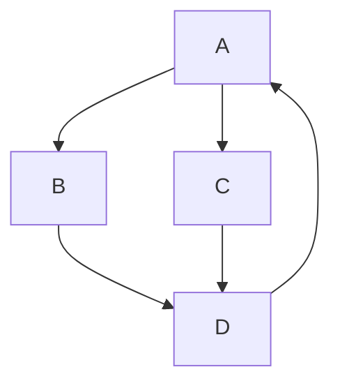
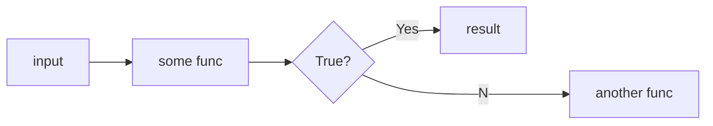
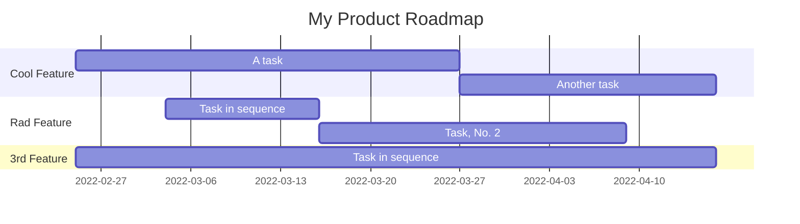

```mermaid
    graph TD;
        A-->B;
        A-->C;
        B-->D;
        C-->D;
        D-->A;
```

```mermaid
flowchart LR;
a[input ]-->b[some func];
b-->c{True?};
c--Yes-->d[result];
c--No-->f[another func]


```

```mermaid
    gantt
    title My Product Roadmap
    dateFormat  YYYY-MM-DD
    section Cool Feature
    A task           :a1, 2022-02-25, 30d
    Another task     :after a1, 20d
    section Rad Feature
    Task in sequence :2022-03-04, 12d
    Task, No. 2      :24d
    section 3rd Feature
    Task in sequence :2022-02-25, 50d
```
